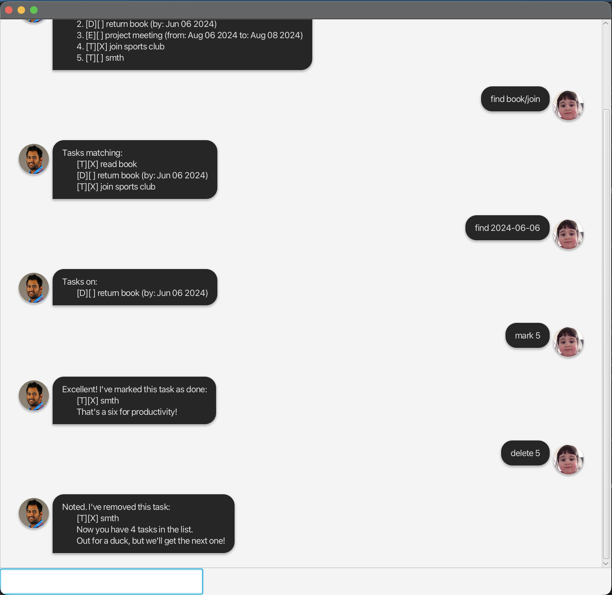

# Dhoni User Guide



Dhoni is a helpful assistant / star cricket player that can keep track of all your tasks and deadlines.
It is designed to help you stay organized and manage your time effectively. 

## Features

1. Task Management
   - Add different types of tasks (todo, deadline, event)
   - Mark tasks as done/undone
   - List all tasks
   - Delete tasks
   - Find tasks 
   - Find dates

## Commands

### 1. Adding Tasks

#### Adding a todo
Adds a simple todo task to your list.

Format: `todo DESCRIPTION`

Example: `todo read book`

Output:
```
Got it. I've added this task:
    [T][ ] read book
    Now you have _ tasks in the list.
    Another run on the board!
```

#### Adding a deadline
Adds a task with a specific deadline.

Format: `deadline DESCRIPTION /by DATE`

Example: `deadline return book 2019-12-02`

Output:
```
Got it. I've added this task:
    [D][ ] return book (by: Dec 2 2019)
    Now you have _ tasks in the list.
    Deadline set - time to finish strong!
```

#### Adding an event
Adds an event with start and end times.

Format: `event DESCRIPTION /from START_TIME /to END_TIME`

Example: `event team meeting /from 2023-09-21/to 2023-09-22`

Output:
```
Got it. I've added this task:
    [E][] team meeting (from: Sep 21 2023 to: Sep 22 2023)
    Now you have 7 tasks in the list.
    Event scheduled - let's make it count!
```

### 2. Managing Tasks

#### Listing all tasks
Shows all tasks in your list.

Format: `list`

Output:
```
Here are the tasks in your list:
    1. [D][] return book (by: Jun 06 2024)
    2. [E][] project meeting (from: Aug 06 2024 to: Aug 08 2024)
    3. [T][X] join sports club
    4. [T][] read book
    5. [D][] return book (by: Dec 02 2019)
    6. [E][] team meeting (from: Sep 21 2023 to: Sep 22 2023)
```

#### Marking a task as done
Marks a task as completed.

Format: `mark INDEX`

Example: `mark 1`

Output:
```
Excellent! I've marked this task as done:
    [D][X] return book (by: Jun 06 2024)
    That's a six for productivity!
```

#### Unmarking a task
Marks a completed task as not done.

Format: `unmark INDEX`

Example: `unmark 1`

Output:
```
OK, I've marked this task as not done yet.
    [D][] return book (by: Jun 06 2024)
```

#### Deleting a task
Removes a task from your list.

Format: `delete INDEX`

Example: `delete 1`

Output:
```
Noted. I've removed this task:
    [D][ ] return book (by: Jun 06 2024)
    Now you have 5 tasks in the list.
    Out for a duck, but we'll get the next one!
```

### 3. Finding tasks 
Searches for tasks containing a specific keyword.

Format: `find KEYWORD[1]/KEYWORD[2]`

Example: `find book/project`

Output:
```
Tasks matching:
    [T][] read book
    [D][] return book (by: Dec 02 2019)
    [E][] project meeting (from: Aug 06 2024 to: Aug 08 2024)
```

### 4. Finding dates

Searches for tasks containing a specific keyword.

Format: `find KEYWORD[1]/KEYWORD[2]`

Example: `find 2024-08-06`

Output:
```
Tasks on:
    [E][] project meeting (from: Aug 06 2024 to: Aug 08 2024)
```

### 5. Saving and Exiting

#### Exiting the program
Saves all tasks and exits the program.

Format: `bye`

Output:
```
Bye. Hope to see you again soon!
```

## Data Storage
- Your tasks are automatically saved after each command
- Tasks are stored in the `data/tasks.txt` file
- The data will be loaded automatically when you restart the program